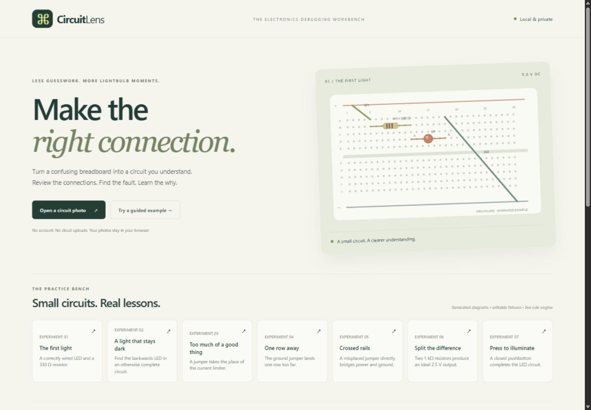
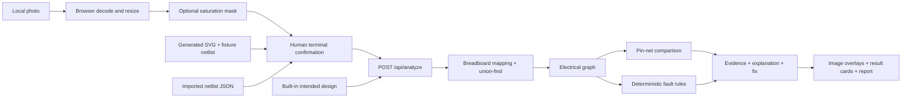

# CircuitLens

**Make the right connection.** A local-first electronics debugging workbench for students and makers.



> Working scope: photo review + manual terminal confirmation + deterministic electrical checks. This MVP does **not** automatically recognize arbitrary circuits and does **not** use an AI model at runtime. Its photo assistance is a simple color-feature mask. Generated examples are explicitly labeled.

## Problem

A breadboard can look almost right while a single misplaced lead prevents it from working. Beginners need to understand which terminals are actually connected, what evidence suggests a fault, and why a change might fix it.

## Solution

CircuitLens combines a photo reference, an editable breadboard netlist, graph-based validation, and educational findings. Seven bundled experiments make the entire review → analyze → correct → re-analyze loop available without hardware, internet access, credentials, or inference services.

## How It Works

1. Open a circuit photo, or choose a labeled generated example.
2. Select a built-in intended circuit: LED/resistor, voltage divider, or button/LED.
3. Confirm component IDs, types, terminals, resistance, button state, and supply voltage. Use **View intended connections** for the reference.
4. For a photo, **Mark ↗** places two optional visual anchors per component. Anchors highlight findings; they do not infer hole labels.
5. Check the confirmation box and analyze. Read evidence, explanation, and corrective action.
6. Edit a connection. Previous results disappear until you confirm and re-analyze.
7. Export the circuit JSON or a JSON analysis report. A visible select-to-copy fallback is available when an embedded browser restricts file downloads.

## Architecture



The Node server serves both frontend and API on one port. Photos remain in browser memory; only entered netlists go to the analysis server. No database, telemetry, account system, external fonts, runtime CDN, or external API is used.

## Computer Vision / AI Pipeline

The browser decodes JPG, PNG, and WebP up to 12 MB and resizes the working canvas to a maximum dimension of 1,000 pixels. The optional saturation mask highlights pixels with sufficient brightness and color spread, while desaturating the remainder. This is image processing, **not** object detection, wire tracing, terminal inference, or a trained model. Colored objects unrelated to the circuit can be highlighted; uncolored wires can be missed.

The reliable fallback is the primary MVP path: a person supplies the observed terminals. Example diagrams ship with known fixture netlists; their netlists are not extracted from the images. No perspective correction, breadboard-region detector, schematic OCR, model weights, training data, or recognition accuracy claims are included.

## Circuit Validation Engine

- `nodeOf` maps A–E in the same numbered row to one strip, and F–J to a separate strip. Rows 1–30 are supported. VCC and GND are logical supply nets.
- Union-find merges wire endpoints and closed-button endpoints. Resistors and LEDs remain graph edges.
- Passive-network traversal checks anode/cathode reachability, open paths, bypassed components, and zero-resistance LED paths. Direct VCC/GND union triggers a critical rail-short finding.
- Labeled pin-net signatures compare electrical connectivity independently of physical row numbers. Reference IDs and A/B pin labels must match; passive lead swaps are not canonicalized.
- Missing/unexpected non-wire components, wrong component types, wrong values, supply differences, and changed pin connectivity produce reference findings. Electrically redundant wires are intentionally not treated as extra components.
- A simple LED path estimate uses `(supply − 2.0 V) / series resistance`, clamped to zero. Above 20 mA is a generic review threshold, not a part rating. Parallel networks are not simulated.
- An unloaded two-resistor divider uses `Vin × Rbottom / (Rtop + Rbottom)`.

Every finding contains its rule code, affected components, severity, evidence, explanation, fix, and a qualitative confidence statement. Multiple findings can describe consequences of the same physical fault; the count is not a count of independent defects.

## Supported Components

| Component  | Representation                       | Scope                                        |
| ---------- | ------------------------------------ | -------------------------------------------- |
| Jumper     | Two hole labels or supply nets       | Ideal zero resistance                        |
| Resistor   | Two terminals, manually entered ohms | 1 Ω–10 MΩ                                    |
| LED        | A = anode, B = cathode               | Simple forward-path checks; assumed 2 V drop |
| Pushbutton | Two terminals, closed/open flag      | Ideal switch, manually entered state         |
| Supply     | Voltage and VCC/GND logical rails    | 0.1–12 V DC                                  |

Physical four-pin button internals and split breadboard rails must be resolved by the user. Sensors and integrated circuits are not supported.

## Example Faults

| Experiment               | Expected result from the live engine                           |
| ------------------------ | -------------------------------------------------------------- |
| The first light          | No supported-rule faults; 9.1 mA estimate                      |
| A light that stays dark  | Reversed LED and reference connectivity differences            |
| Too much of a good thing | Missing current limiter and reference differences              |
| One row away             | Open LED path and reference differences                        |
| Crossed rails            | Critical direct supply short and reference differences         |
| Split the difference     | No supported-rule faults; 2.50 V unloaded output               |
| Press to illuminate      | Closed-button circuit passes; changing to open breaks the path |

## Tech Stack

Native browser ES modules, semantic HTML, CSS, Canvas 2D, and Node.js HTTP. The deterministic engine is plain JavaScript shared by the server and unit tests. Choosing one language and no production packages reduces startup and deployment dependencies. Prettier 3.6.2 is the only development dependency.

## Local Setup

Requires Node.js **22.8+**; tested here with Node 24.14.1 on Windows. From the project directory:

```sh
node server.js
```

Open **http://127.0.0.1:3000**. No package installation is needed to run the app or tests. `npm start` is equivalent.

For formatting tools:

```sh
npm ci
npm run format:check
```

Set `PORT` or `HOST` as shell environment variables if needed. `.env.example` is documentation; the server does not load `.env` automatically.

```powershell
$env:PORT = '3001'
node server.js
```

### Deployment

A Dockerfile is supplied. The runtime has no production dependencies:

```sh
docker build -t circuitlens .
docker run --rm -p 3000:3000 circuitlens
```

For a Node hosting service, use start command `node server.js`, set `HOST=0.0.0.0`, and use the provider's `PORT`. Health endpoint: `/api/health`. There is no frontend build step. Public hosting needs normal HTTPS termination and service-level request limits. There is no authentication; do not treat it as private multi-user storage.

**Deployment status:** local execution verified. Docker and a configured public-hosting target were unavailable in this workspace, so the container and public deployment have not been run. No public URL or deployment success is claimed.

## Usage

### Fastest demo

Choose **A light that stays dark**, confirm the table, and analyze. Then change D1 A to `D12` and D1 B to `D18`, confirm again, and re-analyze. The reversal clears and the simple series current estimate appears. Try **Crossed rails** and **Split the difference** next.

### Netlist interchange

Import the circuit object directly, not an analysis report. Example files are in `public/examples/*.json`.

```json
{
  "voltage": 5,
  "components": [
    { "id": "W1", "type": "wire", "a": "VCC", "b": "A5" },
    { "id": "R1", "type": "resistor", "a": "B5", "b": "B12", "value": 330 },
    { "id": "D1", "type": "led", "a": "D12", "b": "D18" },
    { "id": "W2", "type": "wire", "a": "A18", "b": "GND" }
  ]
}
```

IDs are unique alphanumeric identifiers starting with a letter; `_` and `-` are allowed, up to 20 characters. There is a 100-component and 128 KB request limit. Invalid types, terminals, resistance, voltage, or duplicate IDs return helpful 400 errors.

### API

| Route               | Purpose                                                                   |
| ------------------- | ------------------------------------------------------------------------- |
| `GET /api/health`   | Availability and mode                                                     |
| `GET /api/examples` | Seven fixtures and three reference designs                                |
| `POST /api/analyze` | `{circuit, reference?: "led" / "divider" / "button", expected?: circuit}` |

An API caller can supply a custom `expected` circuit. The UI selects built-in references and imports observed netlists; it does not provide a custom-reference editor.

## Testing

```sh
npm test
npm run check
npm run format:check
```

Tests cover breadboard graph creation, transitive jumper union, all seven fixtures, row-independent reference comparison, missing/extra components, value differences, bypasses, open buttons, current estimates, malformed input, image-mask behavior, API errors, payload size, and static files. Tests use Node's built-in runner with process isolation disabled for compatibility with restricted Windows workspaces.

Browser validation and actual run results are recorded in [submission/verification.md](submission/verification.md). Screenshots are saved under `submission/screenshots/`. These checks are not hardware validation or a benchmark of photo recognition.

## Limitations

- Manual photo interpretation and hole labeling are required. The mask does not recognize components.
- No electrical measurement, continuity sensing, hardware tests, or real-photo detection evaluation has been performed.
- Correct input is essential. Hidden contacts, rail splits, LED ratings, and damaged components remain unknown.
- No general SPICE/DC/AC solver. Series-path current estimates are only meaningful for simple supported topologies. Multiple LEDs and parallel resistor networks can invalidate estimates.
- Reference comparison uses consistent component IDs and pin labels. It does not solve general graph isomorphism or physical resistor lead interchangeability.
- An empty or incomplete netlist cannot certify a circuit. “No supported-rule faults” is not a safety certification.
- All state is in memory. Refresh clears the workbench; export a netlist to preserve work. Photo anchors are not included in exports.
- Generated diagrams stay fixed while edited annotations move. They are references, not reconstructions of the changed build.

## Future Work

Calibrated hole-grid selection and perspective correction; a consent-based labeled photo dataset; evaluated component/terminal suggestions; optional vision-model adapters feeding the same mandatory review step; rail segmentation; passive-pin normalization; and a true circuit solver. Each needs evaluation before claiming reliable recognition or simulation.

## Responsible AI / Model Limitations

This is a rules-based MVP of an AI-assisted product concept. No inference API or pretrained model is currently integrated. Codex assisted with source, tests, documentation, and example artwork generation by code. Confidence describes dependence on entered terminals, not a calibrated probability. Photos stay local; the server receives only the netlist. Results teach supported circuit concepts and should be checked against actual parts and measurements.

## External Tools and Libraries

- Node.js built-in HTTP, filesystem, path, URL, assertion, and test modules.
- Browser DOM, File/Blob, Canvas, fetch, and ES module APIs.
- Prettier 3.6.2 (development formatting only; MIT license, locked in `package-lock.json`).
- Docker base image `node:24-alpine` in the unverified deployment recipe; tag is not digest-pinned.
- Codex for AI-assisted development and browser tooling for manual UI verification.
- No third-party circuit dataset, stock imagery, icon library, pretrained model, external inference API, or code from prior user projects.

## Hackathon Build Information

Created from an empty project workspace for this request, September 30, 2026 (America/New_York). SVG examples are original programmatically generated illustrations and fixture netlists. All demo findings come from the same live engine used for user-confirmed inputs. No performance metrics, user counts, partnerships, or hardware validation are asserted.

The complete submission kit is in [submission/](submission/), including pitches, a timed demo script, architecture, limitations, disclosure, and screenshots.
