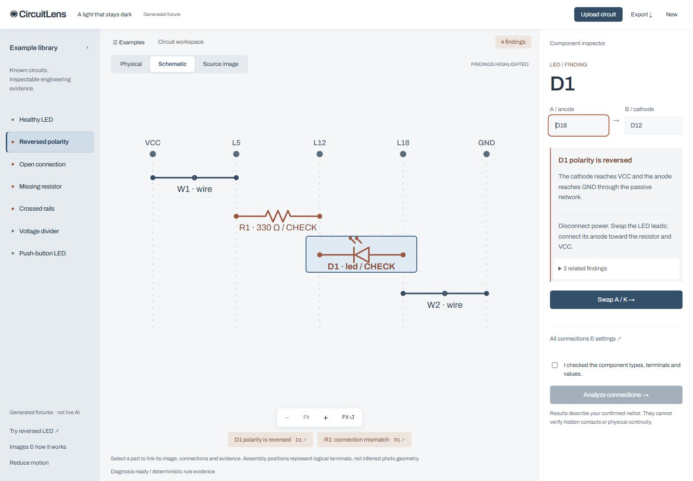
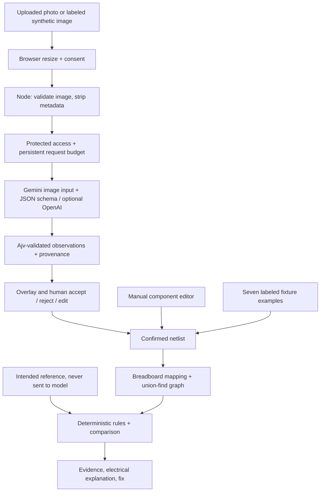
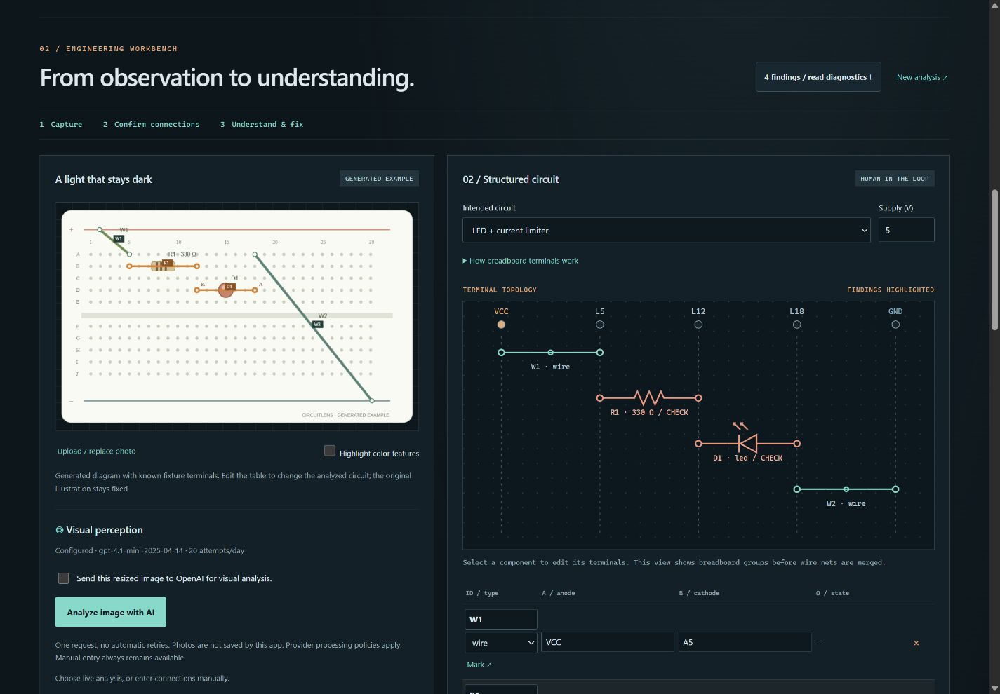

# CircuitLens

**See beyond the schematic.** An electronics debugging workbench with structured visual suggestions, human review and deterministic circuit reasoning.

The editorial website and application are separate pages. The homepage links an actual generated assembly with its connection schematic and a working polarity-correction preview. Locally hosted Archivo and Georgia italic define the typography. `/workbench.html` opens a useful circuit immediately: a collapsible example library, fitted physical/schematic/source canvas, zoom controls and contextual inspector. Connections, image review, and full reports use accessible dialogs. Tablet uses an adapted schematic; phone adds an independently scrolling inspector sheet. Reduced motion removes transitions and defaults to the schematic.

The current **$0 launch passes 64 automated tests**. All seven examples, manual photo review, circuit editing, deterministic diagnosis, and import/export work without an API key. Live recognition is disabled by default, even when an old key exists locally. Gemini 2.5 Flash image recognition is integrated into the existing review interface and is the default provider. It remains disabled until a Free Tier key and billing-disabled confirmation are configured. OpenAI remains an explicitly selected alternative, with no automatic fallback. Actual Gemini recognition awaits key setup; no successful live recognition is claimed. See [Gemini setup](production-launch/GEMINI_SETUP.md). See [deployment](production-launch/DEPLOYMENT.md), [functional verification](production-launch/FUNCTIONAL_TEST_RESULTS.md), and the [launch checklist](production-launch/FINAL_CHECKLIST.md). Earlier official screenshots, videos and Git history are preserved.



> **Current verification boundary:** The runtime OpenAI integration is implemented, but successful live recognition has not been verified. On October 1, five Responses API attempts (correct image three times, reversed once, disconnected once) returned HTTP 429; the diagnostic response identified `credit_balance_exhausted` / `insufficient_quota`. Authentication and access to the selected model were separately verified with HTTP 200 from the models endpoint. No successful model observations, recognition accuracy, or real-hardware validation are claimed. Automated/provider-simulated checks and manual graph demos are separate evidence.

## Problem

One wrong breadboard row can stop a simple circuit working. Beginners need evidence about terminals and polarity, plus an explanation of the electrical consequences.

## Solution

Vision proposes observations, a person corrects them, and deterministic engineering code evaluates the resulting circuit. Manual entry and seven guided examples remain available when inference is unavailable or uncertain.

## How It Works

1. Upload JPEG/PNG/WebP or choose a clearly labeled synthetic vision image.
2. Use manual entry or a fixture example for the $0 launch. Optional Gemini recognition requires explicit server enablement, a Free Tier key, billing-disabled confirmation, and consent; it is unavailable by default.
3. Review component boxes, terminal candidates, type, value, LED orientation and confidence. Accept, reject, edit or add missing parts.
4. Build the netlist from accepted observations. Unknown accepted terminals/values block conversion.
5. Check voltage and reference, confirm the netlist and analyze. Read evidence, why it matters, and a specific fix.
6. Correct terminals and re-analyze. Export the circuit or report to preserve work.

## Architecture



## Computer Vision / AI Pipeline

The default Gemini adapter uses GenerateContent with fixed `gemini-2.5-flash`, inline image bytes and JSON-schema output. It has no tools, grounding, retries or paid fallback. The optional alternative uses the OpenAI Responses API with `gpt-4.1-mini-2025-04-14`, `input_image`, `store:false`, and a strict JSON schema. It receives image pixels only, never the intended circuit. The model proposes component IDs/types, normalized boxes, A/B terminal candidates and points, values, polarity orientation, visible evidence, warnings and confidence. Terminal A is an LED's anode; B is its cathode. Unknown holes and values stay unresolved.

Sharp validates JPEG/PNG/WebP, rejects invalid/oversized input, rotates, resizes to at most 1600 pixels and re-encodes without original metadata. Ajv independently validates returned JSON. There is no learned local object detector, training step, custom model, perspective calibration or general schematic parser.

Every detection begins pending. The browser overlays boxes and endpoints, marks low confidence, and permits individual acceptance, rejection, edits and missing-component entry. Confirmed observations convert into the same netlist used by the original engine; unresolved accepted parts block conversion. Manual entry and seven fixture examples remain usable without API access.

The unchanged electrical reasoning maps A–E and F–J row strips separately (rows 1–30), merges wires and closed switches using union-find, traverses passive paths, and compares labeled pin-net signatures with a reference. It detects reversed LEDs, missing current limiters, open paths, rail shorts, bypasses and reference differences. Explanations are deterministic templates, not model diagnoses. Simple series LED current uses an assumed 2 V drop; divider voltage assumes no load. This is not SPICE or a continuity measurement.

If live recognition is explicitly enabled, requests are serialized within one server process, capped at 20 attempts per UTC day including failures, with a ten-second cooldown and no automatic retries. Use exactly one process/replica. On a free ephemeral host, the local ledger resets on restart; Google's unbilled project quota remains authoritative. Gemini activation requires operator confirmation of billing status; the app cannot inspect Google billing. This application limit is not an OpenAI spend cap. Non-loopback live requests require a private access code. Provider failures are sanitized, and manual analysis remains available. The recipe leaves live mode disabled until key setup; no paid persistent disk is required for Gemini Free Tier.

API documentation: [image input](https://developers.openai.com/api/docs/guides/images-vision), [structured outputs](https://developers.openai.com/api/docs/guides/structured-outputs), [selected model](https://developers.openai.com/api/docs/models/gpt-4.1-mini).

## Circuit Validation Engine

Union-find builds electrical nets; labeled pin-net signatures compare connectivity independently of physical row placement. Reference component IDs and A/B labels must match. Passive-pin swaps are not canonicalized. Rule findings include severity, affected IDs, evidence, explanation, a fix and a qualitative confidence statement tied to confirmed terminals. Multiple findings can describe one physical fault.

## Supported Components

| Part     | Scope                                                   |
| -------- | ------------------------------------------------------- |
| Wire     | Two terminals, ideal conductor                          |
| Resistor | 1 ohm–10 Mohm, confirmed value                          |
| LED      | A anode/B cathode, assumed 2 V drop for simple estimate |
| Button   | Effective two-terminal open/closed switch               |
| Supply   | 0.1–12 V, VCC/GND logical rails                         |

Split rails and four-pin button internals need human interpretation. ICs and sensors are unsupported.

## Example Faults

| Fixture                  | Deterministic result                      |
| ------------------------ | ----------------------------------------- |
| The first light          | Pass; 9.1 mA simple-path estimate         |
| A light that stays dark  | Reversed LED and reference differences    |
| Too much of a good thing | Missing current limiter                   |
| One row away             | Open path                                 |
| Crossed rails            | Critical supply short                     |
| Split the difference     | Pass; ideal unloaded 2.50 V               |
| Press to illuminate      | Closed switch passes; opening breaks path |

Three separate PNG demos under `public/vision-demos` depict correct, reversed and disconnected LED circuits. Their runtime buttons load pixels only. The seven older examples deliberately load known netlists and are labeled fixtures.

## Tech Stack

Browser ES modules, semantic HTML, CSS, Canvas; Node HTTP; Ajv 8.20.0; Sharp 0.35.5; OpenAI Responses API. Prettier 3.6.2 for formatting. Pinned dependencies are in the lockfile.

## Local Setup

Node 22.8+ is required; verified here with Node 24.14.1. Run `npm ci`, then `npm start`; open http://127.0.0.1:3000. Manual mode works without a key. Startup reads ignored `.env.local` if present; `.env.example` contains empty credential placeholders. Store `OPENAI_API_KEY` only on the server. Do not paste it into browser code or commit it.

## Usage

The fastest dependable demo uses “A light that stays dark”: launch its one-click rule check, change D1 from D18/D12 to D12/D18, confirm again, analyze. The image remains the original reference while its netlist changes. The live vision route instead requires usable API credits and image-sharing consent. Every proposal must be reviewed.

| Endpoint                       | Purpose                                                     |
| ------------------------------ | ----------------------------------------------------------- |
| GET /api/health                | Runtime status/version                                      |
| GET /api/examples              | Seven fixtures and three intended references                |
| GET /api/vision-config         | Capability/model/demo metadata; no secrets                  |
| POST /api/perceive             | Consented base64 image to observations/provenance           |
| POST /api/observations/convert | Reviewed observations and voltage to netlist                |
| GET /api/vision-replay/:id     | Actual saved model record only, if one exists               |
| POST /api/analyze              | Confirmed circuit plus reference or custom expected netlist |

The UI uses built-in intended designs; API callers can supply `expected`. It does not interpret uploaded schematic images. Empty netlists cannot certify a circuit. “Highlight color features” is only a saturation mask, not a trained detector.

## Testing

```sh
npm test
npm run check
npm run format:check
npm run build
npm run security:check
```

Current suite: **64 passed, zero failures**. Automated tests never contact either provider. The explicitly simulated UI harness is `node scripts/mock-vision-server.js` on port 3003, or add `--gemini` for Gemini-shaped mocks on port 3007, labeled as such and excluded from the production artifact. The evaluation CLI refuses provider requests unless `LIVE_VISION_ENABLED=true`; Gemini additionally requires Free Tier confirmation and never falls back to OpenAI. Genuine observations are recorded only after successful model responses; none currently exist. See [current verification](production-launch/FUNCTIONAL_TEST_RESULTS.md). Older verification sections below document earlier milestones.

## Production and Deployment

`npm run build` creates an allowlisted `dist` package; it excludes environment files, usage state and test/provider mocks. `npm ci --omit=dev --prefix dist` installs clean runtime dependencies; `node dist/server.js` starts it. Production startup requires host-provided secrets because `.env.local` is deliberately not copied.

A multi-stage Dockerfile and a **free Node web-service** `render.yaml` are included. The recipe sets `HOST=0.0.0.0` and `LIVE_VISION_ENABLED=false`, uses the host-assigned port, and provisions no disk, database, or API credentials. Use a free workspace without a payment method and do not enable paid overages or add-ons. Follow the [exact deployment steps](production-launch/DEPLOYMENT.md).

The repository has a GitHub remote. Render's dashboard currently shows its sign-in page; no authenticated hosting account was available. Local production build, startup, and HTTP smoke passed. Public deployment and Docker execution were not performed. No public URL is claimed.

## Limitations

- Successful live extraction remains unverified due to API credits. No recognition accuracy is claimed.
- No real hardware photo dataset, continuity measurements or user study. Synthetic labeled diagrams are easier than real breadboards.
- Scores are uncalibrated. Hidden contacts, obscured polarity, resistor markings, split rails and unsupported components need human review.
- No SPICE solver; parallel networks can invalidate simple current estimates. Correct inputs are essential.
- Reference IDs and pin labels matter; no general graph-isomorphism solver.
- Review state is in browser memory; refresh clears it. Exports preserve netlists, not uploaded images.
- The usage guard is single-process. Ephemeral hosting resets its ledger; Google's free project quota remains authoritative. It is not a dollar-denominated provider cap.

## Future Work

Complete live evaluations after credits resolve; then test consented real photos with per-component/terminal ground truth, calibration and correction-rate measurements. Improve perspective/grid localization, rail splits, passive-pin matching and multi-process budgets before expanding hardware scope.

## Responsible AI / Model Limitations

Consent is required to send image pixels to OpenAI. Uploaded images are not saved by this application. `store:false` does not promise zero provider retention. Intended references never enter the perception request. Explanations and diagnoses come from deterministic code. See [AI disclosure](submission/ai-disclosure.md) for credential provisioning limits, simulated data and AI-assisted development.

## External Tools and Libraries

Original CircuitLens code is licensed under [MIT](LICENSE). Dependencies retain their own licenses. The package is marked private to prevent accidental npm publication.

Node/browser built-ins; Ajv (MIT); Sharp (Apache-2.0 and its bundled native dependencies); Prettier (MIT); pretrained OpenAI model/API; Codex for development; Docker Node base image (tag, not digest-pinned). No copied prior-user project, external circuit dataset or third-party stock photo was used. Dependency licenses remain in installed packages.

## Hackathon Build Information

Started September 30, 2026. Base commit `e3f6275` is preserved. Early uncommitted perception scaffolding also predates October 1; the October 1 upgrade completes review/integration, validation, tests and deployment packaging. [Build-period disclosure](submission/build-period-disclosure.md) separates these accurately.

Tailored materials: [LovHack](submission/lovhack/), [CSC](submission/csc/), [ML Empowerment](submission/ml-empowerment/), [ImpactHack](submission/impacthack/). They are draft submission copy, not submitted entries or eligibility certifications. No demo video or public repository link has been fabricated.

[GIBC V2 Track 03 materials](submission/gibc-v2/) package the same CircuitLens build honestly, including nine new screenshots and a roughly three-minute video script. The event’s deadline text conflicts; no submission or eligibility is claimed.

## Previous verified engineering workbench design



The original lens-and-trace identity and cyan/copper lab palette carry through image review, terminal topology and fault reports. Select any schematic component to edit its terminals; select an evidence link to inspect the implicated part. Editing invalidates the old result. Seven fixture buttons run checks immediately, with generated inputs labeled. Uploaded/AI-proposed builds still require review and confirmation.

The terminal schematic shows physical breadboard group labels before ideal-conductor merging. The merged electrical graph remains inspectable in the report. Healthy-state moving dashes are a status cue, not measured current. The perception review places the image/overlays beside decisions and marks edited observations. Unknown accepted terminals still block conversion.

The frontend has no added visual framework or external fonts. Keyboard focus, textual severity/status, responsive scrolling and system reduced-motion support are retained. A footer motion control also lets viewers disable animation. Browser checks covered desktop (1440), laptop (1280), tablet (768) and mobile (390) widths with no document overflow; schematic/table scrolling remains contained.

Final verification: 42 tests, zero dependency vulnerabilities, production startup and 29 asset/route checks plus all seven demo outcomes. `node scripts/smoke-production.js` reproduces the credential-free smoke against an already-running `dist` server on port 3005; it never calls perception. See [redesign verification](submission/evaluation/redesign-verification.md) and the [final screenshot selection](submission/gibc-v2/11-screenshot-list.md).

## Cinematic circuit experience

The subsequent October 1–2 presentation upgrade uses an original SVG board with layered CSS 3D components, pointer/scroll motion, six continuous story scenes, and a cream graph transition. The product workbench places image, terminal topology and properties in three columns on wide screens. Seven numbered fixtures, evidence-led diagnosis, qualified confidence review and a seven-stage architecture retain the original engineering boundaries. Request-stage labels respond to actual requests; there are no artificial analysis delays.

This illustration is separate from runtime perception. A static scene navigation mode respects reduced motion; no WebGL support or new visual dependency is required. Browser inspection is still blocked, so layout, animation and console results are not certified. Current automated verification is 44 passing tests, zero audit vulnerabilities, a 41-file production package, and 33 HTTP asset/route checks plus seven fixture outcomes. [Verification and remaining work](submission/evaluation/cinematic-verification.md), [capture queue](submission/screenshots-cinematic/README.md), [2:45 recording materials](submission/cinematic-demo/recording-script.md).
