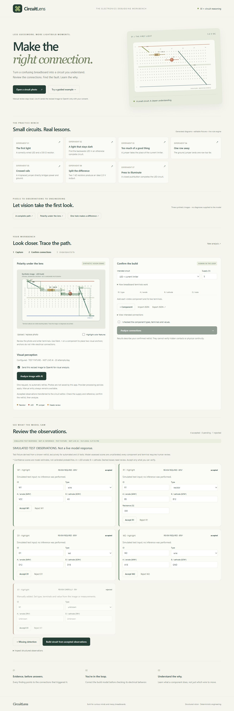
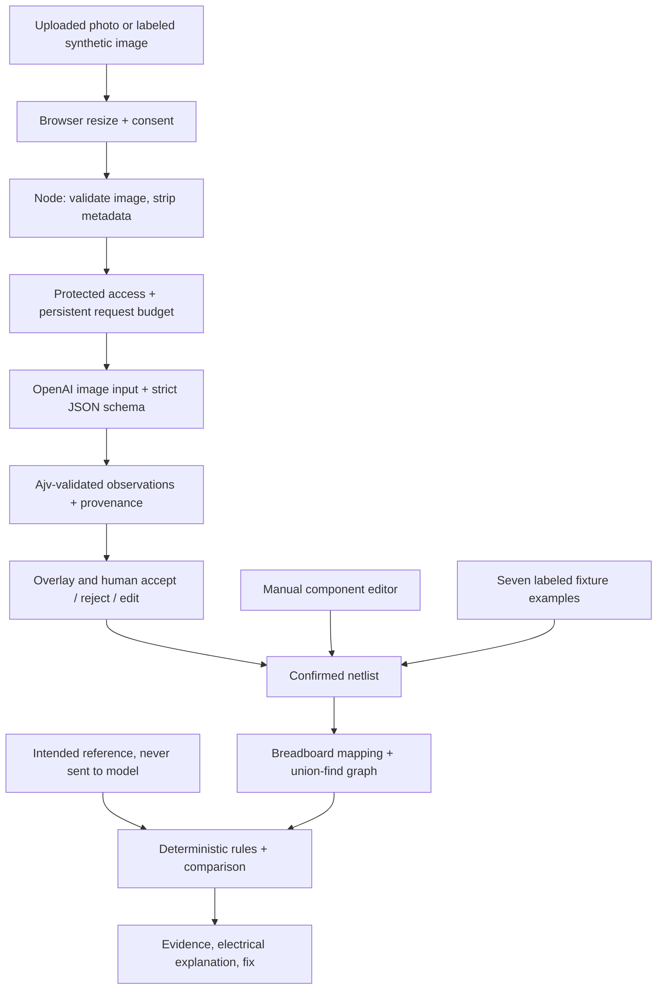

# CircuitLens

**Make the right connection.** An electronics debugging workbench with structured visual suggestions, human review and deterministic circuit reasoning.



> **Current verification boundary:** The runtime OpenAI integration is implemented, but successful live recognition has not been verified. On October 1, five Responses API attempts (correct image three times, reversed once, disconnected once) returned HTTP 429; the diagnostic response identified `credit_balance_exhausted` / `insufficient_quota`. Authentication and access to the selected model were separately verified with HTTP 200 from the models endpoint. No successful model observations, recognition accuracy, or real-hardware validation are claimed. Automated/provider-simulated checks and manual graph demos are separate evidence.

## Problem

One wrong breadboard row can stop a simple circuit working. Beginners need evidence about terminals and polarity, plus an explanation of the electrical consequences.

## Solution

Vision proposes observations, a person corrects them, and deterministic engineering code evaluates the resulting circuit. Manual entry and seven guided examples remain available when inference is unavailable or uncertain.

## How It Works

1. Upload JPEG/PNG/WebP or choose a clearly labeled synthetic vision image.
2. Consent to image sharing and run AI analysis. Without API access, use manual entry or a fixture example.
3. Review component boxes, terminal candidates, type, value, LED orientation and confidence. Accept, reject, edit or add missing parts.
4. Build the netlist from accepted observations. Unknown accepted terminals/values block conversion.
5. Check voltage and reference, confirm the netlist and analyze. Read evidence, why it matters, and a specific fix.
6. Correct terminals and re-analyze. Export the circuit or report to preserve work.

## Architecture



## Computer Vision / AI Pipeline

The server uses the OpenAI Responses API with `gpt-4.1-mini-2025-04-14`, `input_image`, `store:false`, and a strict JSON schema. It receives image pixels only, never the intended circuit. The model proposes component IDs/types, normalized boxes, A/B terminal candidates and points, values, polarity orientation, visible evidence, warnings and confidence. Terminal A is an LED's anode; B is its cathode. Unknown holes and values stay unresolved.

Sharp validates JPEG/PNG/WebP, rejects invalid/oversized input, rotates, resizes to at most 1600 pixels and re-encodes without original metadata. Ajv independently validates returned JSON. There is no learned local object detector, training step, custom model, perspective calibration or general schematic parser.

Every detection begins pending. The browser overlays boxes and endpoints, marks low confidence, and permits individual acceptance, rejection, edits and missing-component entry. Confirmed observations convert into the same netlist used by the original engine; unresolved accepted parts block conversion. Manual entry and seven fixture examples remain usable without API access.

The unchanged electrical reasoning maps A–E and F–J row strips separately (rows 1–30), merges wires and closed switches using union-find, traverses passive paths, and compares labeled pin-net signatures with a reference. It detects reversed LEDs, missing current limiters, open paths, rail shorts, bypasses and reference differences. Explanations are deterministic templates, not model diagnoses. Simple series LED current uses an assumed 2 V drop; divider voltage assumes no load. This is not SPICE or a continuity measurement.

Requests are serialized within one server process, capped at 20 attempts per UTC day including failures, with a ten-second cooldown and no automatic retries. The ledger must be persistent and the deployment must use exactly one process/replica. This application limit is not an OpenAI spend cap. Non-loopback live requests require a private access code. Provider failures are sanitized, and manual analysis remains available.

API documentation: [image input](https://developers.openai.com/api/docs/guides/images-vision), [structured outputs](https://developers.openai.com/api/docs/guides/structured-outputs), [selected model](https://developers.openai.com/api/docs/models/gpt-4.1-mini).

## Circuit Validation Engine

Union-find builds electrical nets; labeled pin-net signatures compare connectivity independently of physical row placement. Reference component IDs and A/B labels must match. Passive-pin swaps are not canonicalized. Rule findings include severity, affected IDs, evidence, explanation, a fix and a qualitative confidence statement tied to confirmed terminals. Multiple findings can describe one physical fault.

## Supported Components

| Part     | Scope                                                   |
| -------- | ------------------------------------------------------- |
| Wire     | Two terminals, ideal conductor                          |
| Resistor | 1 ohm–10 Mohm, confirmed value                          |
| LED      | A anode/B cathode, assumed 2 V drop for simple estimate |
| Button   | Effective two-terminal open/closed switch               |
| Supply   | 0.1–12 V, VCC/GND logical rails                         |

Split rails and four-pin button internals need human interpretation. ICs and sensors are unsupported.

## Example Faults

| Fixture                  | Deterministic result                      |
| ------------------------ | ----------------------------------------- |
| The first light          | Pass; 9.1 mA simple-path estimate         |
| A light that stays dark  | Reversed LED and reference differences    |
| Too much of a good thing | Missing current limiter                   |
| One row away             | Open path                                 |
| Crossed rails            | Critical supply short                     |
| Split the difference     | Pass; ideal unloaded 2.50 V               |
| Press to illuminate      | Closed switch passes; opening breaks path |

Three separate PNG demos under `public/vision-demos` depict correct, reversed and disconnected LED circuits. Their runtime buttons load pixels only. The seven older examples deliberately load known netlists and are labeled fixtures.

## Tech Stack

Browser ES modules, semantic HTML, CSS, Canvas; Node HTTP; Ajv 8.20.0; Sharp 0.35.5; OpenAI Responses API. Prettier 3.6.2 for formatting. Pinned dependencies are in the lockfile.

## Local Setup

Node 22.8+ is required; verified here with Node 24.14.1. Run `npm ci`, then `npm start`; open http://127.0.0.1:3000. Manual mode works without a key. Startup reads ignored `.env.local` if present; `.env.example` contains empty credential placeholders. Store `OPENAI_API_KEY` only on the server. Do not paste it into browser code or commit it.

## Usage

The fastest dependable demo uses “A light that stays dark”: confirm, analyze, change D1 from D18/D12 to D12/D18, confirm again, analyze. The image remains the original reference while its netlist changes. The live vision route instead requires usable API credits and image-sharing consent. Every proposal must be reviewed.

| Endpoint                       | Purpose                                                     |
| ------------------------------ | ----------------------------------------------------------- |
| GET /api/health                | Runtime status/version                                      |
| GET /api/examples              | Seven fixtures and three intended references                |
| GET /api/vision-config         | Capability/model/demo metadata; no secrets                  |
| POST /api/perceive             | Consented base64 image to observations/provenance           |
| POST /api/observations/convert | Reviewed observations and voltage to netlist                |
| GET /api/vision-replay/:id     | Actual saved model record only, if one exists               |
| POST /api/analyze              | Confirmed circuit plus reference or custom expected netlist |

The UI uses built-in intended designs; API callers can supply `expected`. It does not interpret uploaded schematic images. Empty netlists cannot certify a circuit. “Highlight color features” is only a saturation mask, not a trained detector.

## Testing

```sh
npm test
npm run check
npm run format:check
npm run build
npm run security:check
```

Current suite: **39 passed, zero failures**. Automated tests never call OpenAI. The explicitly simulated UI harness is `node scripts/mock-vision-server.js` on port 3003, labeled as such and excluded from the production artifact. The opt-in evaluation command is `npm run evaluate:vision`; `node scripts/evaluate-vision.js --live --record --one` limits a diagnostic recheck to one image. These consume the same daily attempt ledger. Do not run concurrently with another server process using that ledger. Genuine observations are recorded only after successful model responses; none currently exist. See [verification](submission/verification.md).

## Production and Deployment

`npm run build` creates an allowlisted `dist` package; it excludes environment files, usage state and test/provider mocks. `npm ci --omit=dev --prefix dist` installs clean runtime dependencies; `node dist/server.js` starts it. Production startup requires host-provided secrets because `.env.local` is deliberately not copied.

A multi-stage Dockerfile and `render.yaml` are included. Set `HOST=0.0.0.0`, host-assigned `PORT`, server `OPENAI_API_KEY`, private `VISION_ACCESS_CODE`, and persistent `VISION_USAGE_FILE`. Run **one process/replica**. Use HTTPS termination. Render's recipe includes a persistent disk and a paid service tier: nothing has been provisioned or purchased. Blueprint configuration follows [Render's specification](https://render.com/docs/blueprint-spec).

Deployment probe reached Render's sign-in page. No configured Git remote or authenticated Node hosting account was available. Local production build and HTTP smoke passed; Docker execution and public deployment were not performed. Do not publish a static-only frontend as if the server AI path were running.

## Limitations

- Successful live extraction remains unverified due to API credits. No recognition accuracy is claimed.
- No real hardware photo dataset, continuity measurements or user study. Synthetic labeled diagrams are easier than real breadboards.
- Scores are uncalibrated. Hidden contacts, obscured polarity, resistor markings, split rails and unsupported components need human review.
- No SPICE solver; parallel networks can invalidate simple current estimates. Correct inputs are essential.
- Reference IDs and pin labels matter; no general graph-isomorphism solver.
- Review state is in browser memory; refresh clears it. Exports preserve netlists, not uploaded images.
- The usage guard is single-process and needs persistent storage. It is not a dollar-denominated provider cap.

## Future Work

Complete live evaluations after credits resolve; then test consented real photos with per-component/terminal ground truth, calibration and correction-rate measurements. Improve perspective/grid localization, rail splits, passive-pin matching and multi-process budgets before expanding hardware scope.

## Responsible AI / Model Limitations

Consent is required to send image pixels to OpenAI. Uploaded images are not saved by this application. `store:false` does not promise zero provider retention. Intended references never enter the perception request. Explanations and diagnoses come from deterministic code. See [AI disclosure](submission/ai-disclosure.md) for credential provisioning limits, simulated data and AI-assisted development.

## External Tools and Libraries

Original CircuitLens code is licensed under [MIT](LICENSE). Dependencies retain their own licenses. The package is marked private to prevent accidental npm publication.

Node/browser built-ins; Ajv (MIT); Sharp (Apache-2.0 and its bundled native dependencies); Prettier (MIT); pretrained OpenAI model/API; Codex for development; Docker Node base image (tag, not digest-pinned). No copied prior-user project, external circuit dataset or third-party stock photo was used. Dependency licenses remain in installed packages.

## Hackathon Build Information

Started September 30, 2026. Base commit `e3f6275` is preserved. Early uncommitted perception scaffolding also predates October 1; the October 1 upgrade completes review/integration, validation, tests and deployment packaging. [Build-period disclosure](submission/build-period-disclosure.md) separates these accurately.

Tailored materials: [LovHack](submission/lovhack/), [CSC](submission/csc/), [ML Empowerment](submission/ml-empowerment/), [ImpactHack](submission/impacthack/). They are draft submission copy, not submitted entries or eligibility certifications. No demo video or public repository link has been fabricated.

[GIBC V2 Track 03 materials](submission/gibc-v2/) package the same CircuitLens build honestly, including seven fresh screenshots and a 3:30 video script. The event’s deadline text conflicts; no submission or eligibility is claimed.
