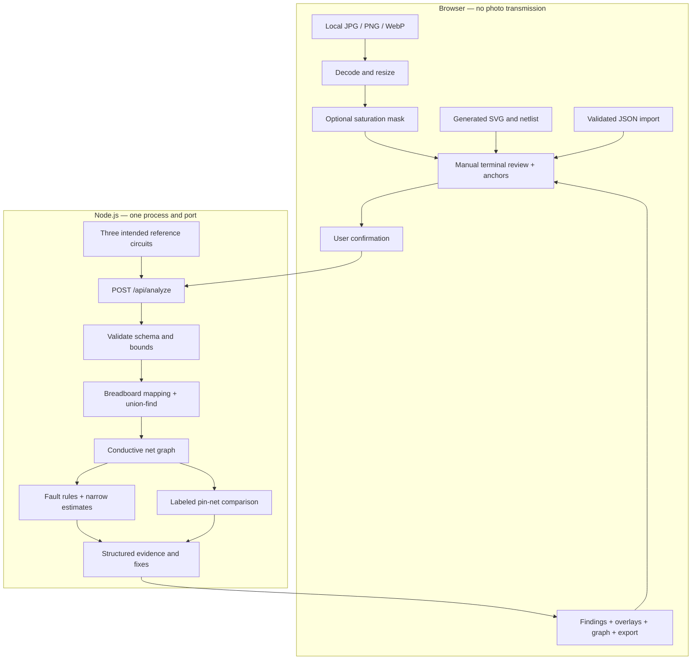

# Architecture

`public/app.js` owns transient UI state. `public/vision.js` is the pure pixel mask. `src/engine.js` owns graph construction, comparison, and analysis. `src/examples.js` defines references and editable fixtures. `src/generate-examples.js` creates original SVG/JSON files. `server.js` provides bounded JSON input and static serving.

There is no database, authentication, persistence, model inference, or external runtime service. The browser sends confirmed netlists to its same-origin server. On a public host those netlists reach that host; photos still remain in browser memory.
