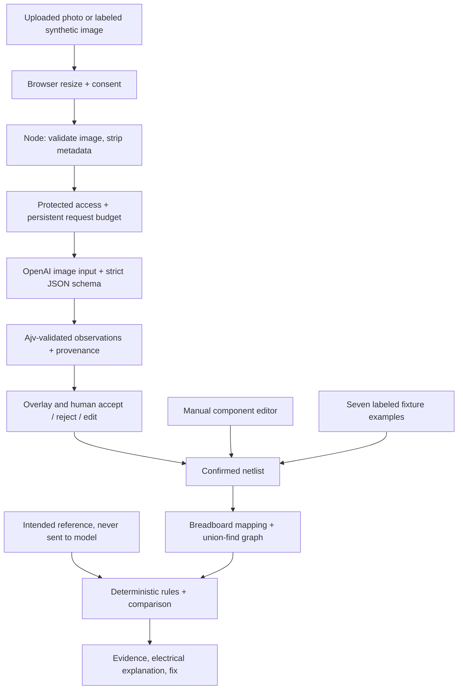

# Architecture

The server uses the OpenAI Responses API with `gpt-4.1-mini-2025-04-14`, `input_image`, `store:false`, and a strict JSON schema. It receives image pixels only, never the intended circuit. The model proposes component IDs/types, normalized boxes, A/B terminal candidates and points, values, polarity orientation, visible evidence, warnings and confidence. Terminal A is an LED's anode; B is its cathode. Unknown holes and values stay unresolved.

Sharp validates JPEG/PNG/WebP, rejects invalid/oversized input, rotates, resizes to at most 1600 pixels and re-encodes without original metadata. Ajv independently validates returned JSON. There is no learned local object detector, training step, custom model, perspective calibration or general schematic parser.

Every detection begins pending. The browser overlays boxes and endpoints, marks low confidence, and permits individual acceptance, rejection, edits and missing-component entry. Confirmed observations convert into the same netlist used by the original engine; unresolved accepted parts block conversion. Manual entry and seven fixture examples remain usable without API access.

The unchanged electrical reasoning maps A–E and F–J row strips separately (rows 1–30), merges wires and closed switches using union-find, traverses passive paths, and compares labeled pin-net signatures with a reference. It detects reversed LEDs, missing current limiters, open paths, rail shorts, bypasses and reference differences. Explanations are deterministic templates, not model diagnoses. Simple series LED current uses an assumed 2 V drop; divider voltage assumes no load. This is not SPICE or a continuity measurement.

Requests are serialized within one server process, capped at 20 attempts per UTC day including failures, with a ten-second cooldown and no automatic retries. The ledger must be persistent and the deployment must use exactly one process/replica. This application limit is not an OpenAI spend cap. Non-loopback live requests require a private access code. Provider failures are sanitized, and manual analysis remains available.
