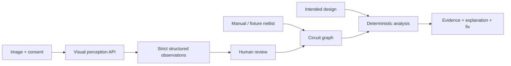

# How it works

1. Choose a circuit photo, a synthetic visual input, or one of seven fixture examples.
2. For live perception, explicitly consent to sharing a resized image. The intended design is not sent to the model.
3. Review boxes, component types, LED A/B orientation, terminal candidates, values and confidence. Unknowns require correction. Accept, reject, edit or add parts individually.
4. Convert accepted observations to the netlist. Unresolved accepted parts block conversion. Manual entry works independently of AI.
5. Select the intended design, check voltage and confirm the netlist.
6. The engine maps row strips and conductor unions, forms nets, compares topology and runs fault rules.
7. Read the evidence, why it matters and the fix; edit terminals and re-analyze. Export the netlist or report to preserve work.

## Three distinct evidence modes

- **Fixture demo:** known netlist loaded with a generated diagram, then analyzed by real deterministic code.
- **Simulated perception:** development/test-only observation response, labeled on screen; proves review integration, not model recognition.
- **Live vision:** actual model request; currently all recorded attempts failed for exhausted credits. No successful recognition result is available.

## Redesigned review experience

The observation pane, selectable terminal schematic and diagnostic report use a consistent laboratory visual language. Select a schematic component or an evidence link to reach its editable terminals. One-click fixtures immediately run the engine on labeled netlists. The image review keeps boxes and confidence beside decisions; edited observations return to pending. Reduced motion is available through system preference and the footer control. None of these presentation changes decide electrical validity.
